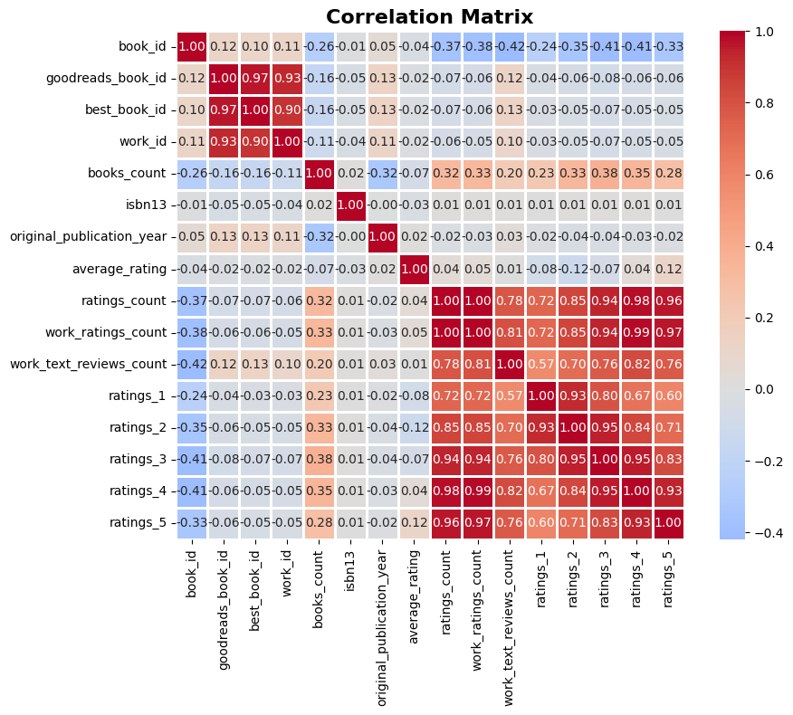

# Dataset Analysis Report

## Dataset Overview
This analysis examines a dataset with 10000 rows and 23 columns.

## Key Statistics
- Total records: 10000
- Total features: 23
- Missing data found in 5 columns

## Visualizations

