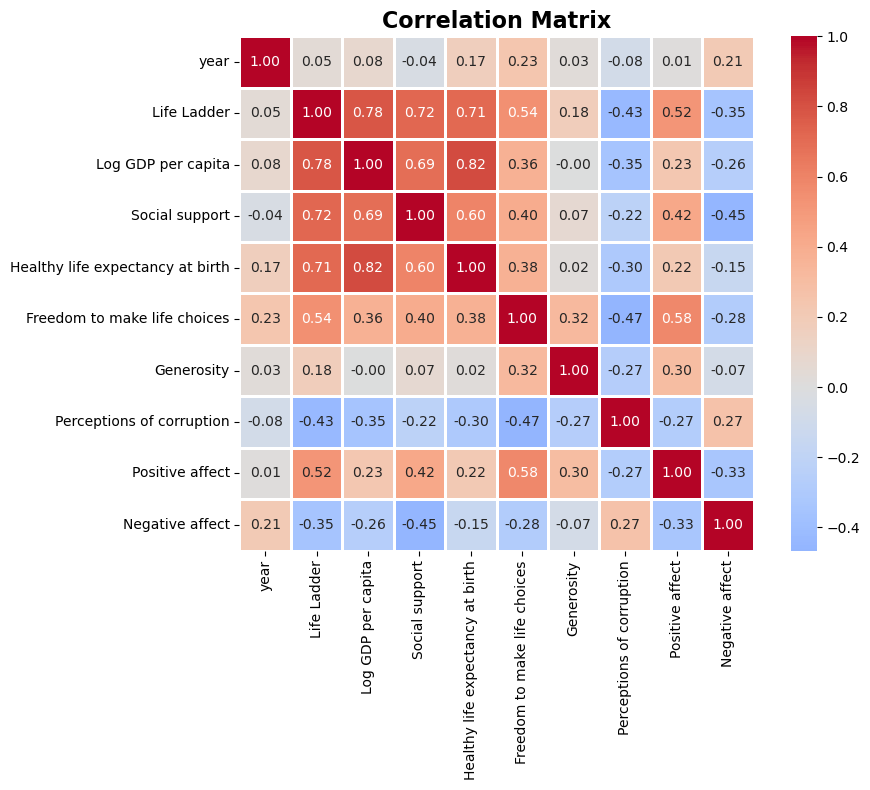
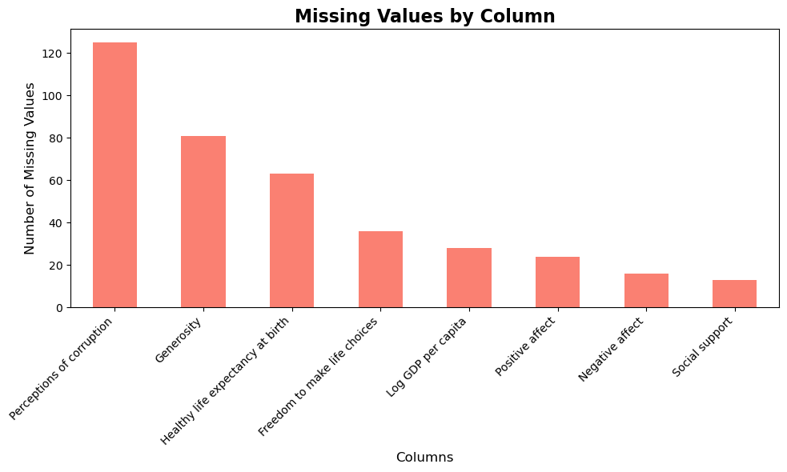
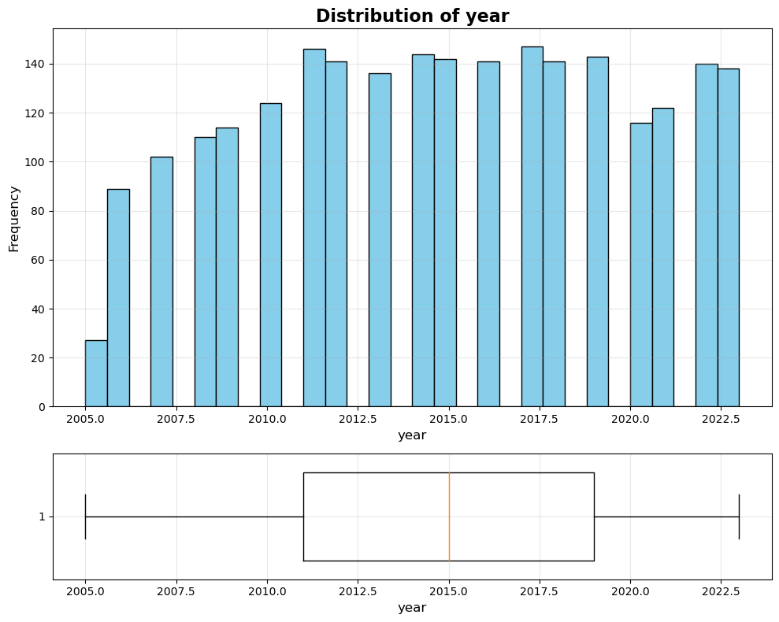

# Dataset Analysis Report

## Dataset Overview
This analysis examines a dataset with 2363 rows and 11 columns.

## Key Statistics
- Total records: 2363
- Total features: 11
- Missing data found in 8 columns

## Visualizations

