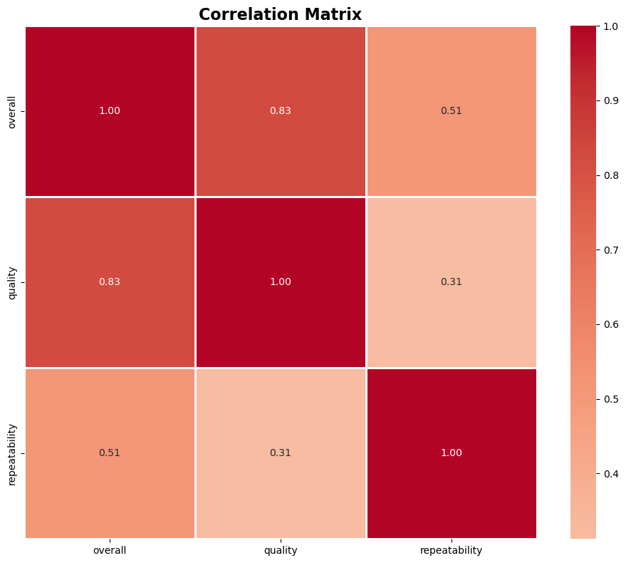
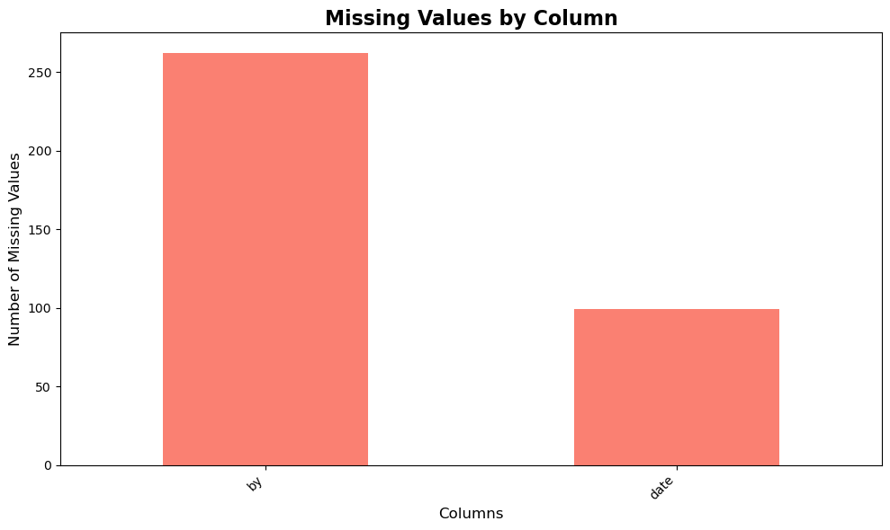
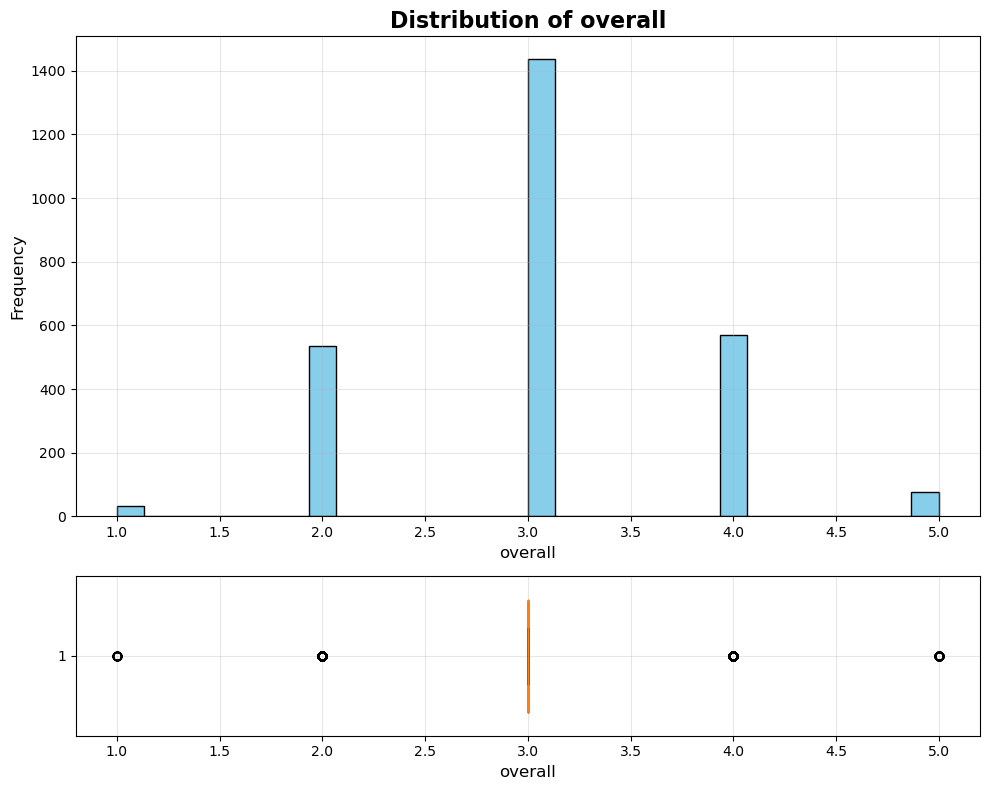

# Dataset Analysis Report

## Dataset Overview
This analysis examines a dataset with 2652 rows and 8 columns.

## Key Statistics
- Total records: 2652
- Total features: 8
- Missing data found in 2 columns

## Visualizations

